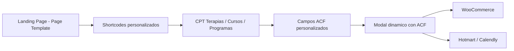
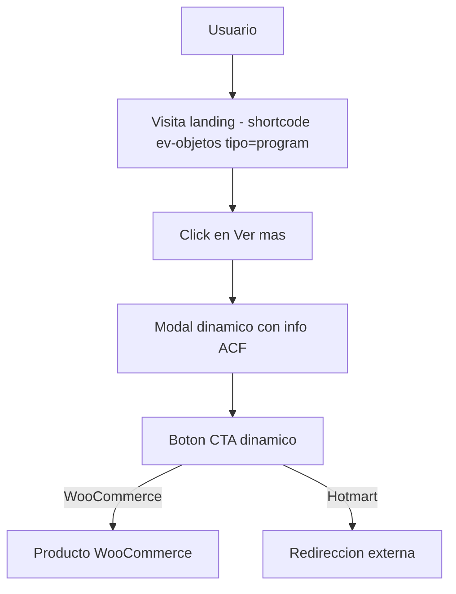

# 🌟 Escuela Mística – Documento de Arquitectura y Entrega

**Versión:** 1.0  
**Autor:** Espacios Virtuales  
**Fecha:** Octubre 2025  

---

## 🔮 Visión

_Escuela Mística_ es una plataforma digital enfocada en el desarrollo espiritual y emocional de las personas, integrando terapias, cursos y programas con un enfoque humano, sensible y tecnológicamente eficiente.

> *“Tecnología con alma. Presencia con propósito.”*

---

## 🧠 Lógica de Negocio

- **Modelo Modular:** Basado en CPT (Custom Post Types) para `terapias`, `cursos`, `programas`.
- **Compra Validada:** Integración con WooCommerce y pasarelas externas (como Hotmart) según el tipo de contenido.
- **Gestión de Sesiones:** A través de metaboxes vinculados a Calendly o links externos.
- **Contenido dinámico:** ACF y shortcodes personalizados que habilitan composiciones editables desde WordPress.
- **Distribución:** Unificada en landings temáticas con secciones reutilizables (`descripción`, `propuesta`, `cliente ideal`, etc).

---

## ⚙️ Funcionamiento General

---

## 🧩 Herramientas y Componentes Usados

### 🔗 CMS & Backend
- WordPress 6+
- ACF Free
- WooCommerce
- Plugin LMS Espacios Virtuales
- Sender Corporativo

### 🧱 Componentes
- Shortcodes `[ev-objetos tipo="terapia"]`, `[ev-intro_video_modal]`
- Custom Post Types:
  - `course` (Cursos)
  - `program` (Programas)
  - `terapia` (Terapias)
- Metaboxes personalizados para:
  - Producto WooCommerce (`_linked_product_id`, `_course_product_id`)
  - Link Hotmart (`course_payment_url`)
  - Formatos (`grabado`, `presencial`, `online`)

### 💌 Emails
- Envío automático post-compra o post-contacto
- Plantillas en HTML embebido con branding místico
- Plugin WP Mail SMTP como fallback para asegurar entrega

### 💡 UI/UX
- Hero dinámico con imagen + ACF
- Sección modular (`descripcion`, `objetivo`, `propuesta de valor`)
- Cards responsive con modales de contenido extendido
- Estilos SCSS modularizados (`ev-*`)
- Bootstrap 5 + AOS + Anime.js para interactividad visual

---

## 🔁 Flujo de Venta

---

## 📚 Archivos Relacionados

| Documento | Descripción |
|----------|-------------|
| `SHORTCODES.md` | Registro de todos los shortcodes |
| `ARQUITECTURA.md` | Arquitectura general del tema madre |
| `POLITICAS_CODIGO.md` | Reglas PSR-12 / JS / SCSS para todos los servicios y shortcodes |
| `Tema-Madre-Documentacion.md` | Readme extendido para setup completo |

---

## 📌 Checkpoint de Entrega

- [x] Registro y metabox de CPT `course`, `program`, `terapia`
- [x] Shortcode `ev-objetos` funcionando con lógica diferenciada
- [x] Estilos SCSS con responsividad y modales
- [x] Emails de confirmación operativos (via WP Mail SMTP)
- [x] Modularización del tema (`inc/modules/emails`, `woocommerce` )
- [x] Documentación integrada y generada
- [x] Cumplimiento de políticas de código en shortcodes, SCSS y plugin LMS

---
