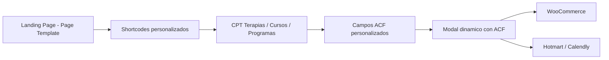

# 🕊️ Escuela Mística — Informe Técnico & Guía de Estilo
**Versión:** 1.1.0  
**Desarrollado por:** Espacios Virtuales · EVAAS  
**Plataforma:** WordPress + WooCommerce + PayPal + Sender Autónomo  
**Fecha:** Noviembre 2025  

---

## 🌸 Resumen Ejecutivo

El proyecto **Escuela Mística** integra **branding, desarrollo web y estructura comercial** bajo la infraestructura técnica de **Espacios Virtuales**, ofreciendo una experiencia coherente entre lo visual, lo espiritual y lo digital.

Se implementó una **web corporativa en WordPress** con un **flujo completo de venta y comunicación**, acompañada de un sistema SEO básico y un diseño armónico con la estética del ecosistema EVAAS.

**Principales características del desarrollo:**  
- WordPress + WooCommerce (tienda activa)  
- Pasarela de pago **PayPal**  
- Módulo de envío **Sender embebido (autónomo)**  
- SEO básico en Home, Sobre Nosotros, Servicios, Catálogo y Blog  
- Sistema de estilos modular en **Sass / Bootstrap 5**  
- Integración visual coherente con el **Brandbook EVAAS**  

---

## 🧭 Contexto Ecosistémico

**Espacios Virtuales** es un ecosistema modular que unifica lo digital y lo físico, orientado a la gestión de **recursos, conocimiento, energía y comunidades**.  
Su núcleo técnico, **EVAAS**, provee la base conceptual y tecnológica sobre la cual se articulan los diferentes proyectos asociados, incluyendo Escuela Mística.

El sitio de **Escuela Mística** se plantea como una manifestación **educativa, terapéutica y espiritual**, vinculando la enseñanza, los programas de autoconocimiento y la economía consciente.

---

## 🎨 Identidad Visual

| Token | Color | Significado |
|:--|:--|:--|
| `$primary` | `#483D8B` | Violeta místico — espiritualidad y sabiduría |
| `$secondary` | `rgb(75,0,130)` | Índigo profundo — introspección y misterio |
| `$gold` | `#FFD700` | Dorado sagrado — iluminación, energía interior |
| `$emerald` | `#50C878` | Verde esmeralda — equilibrio y sanación |
| `$blue-dark` | `#0F0C3E` | Azul noche — contención y silencio |
| `$gray-light` | `#F5F5F5` | Neutro claro — soporte tipográfico |
| `$text-light` | `#F8F9FA` | Texto en fondos oscuros |
| `$text-muted` | `#B3B3B3` | Subtítulos o comentarios secundarios |

**Tipografía:**  
Cormorant Garamond (base) · Libre Baskerville (títulos)  

**Principios:** equilibrio, serenidad, claridad y armonía simbólica.

---

## 🧩 Estructura Técnica SCSS

```
assets/scss/
├─ components/
│  ├─ _globals.scss
│  ├─ layout/_header.scss
│  ├─ layout/_footer.scss
│  ├─ blocks/
│  └─ _index.scss
├─ utilities/
│  ├─ _responsive.scss
│  ├─ _css-vars.scss
│  ├─ _bootstrap-overrides.scss
│  └─ _index.scss
└─ main.scss
```

**Compilación principal:**
```scss
@import "bootstrap/scss/functions";
@import "components/globals";
@import "bootstrap/scss/bootstrap";
@import "utilities/css-vars";
@import "utilities";
@import "components/index";
@import "utilities/bootstrap-overrides";
```

El sistema permite ampliar o modificar componentes sin afectar la coherencia visual general del tema.

---

## 📚 Registro de Shortcodes

| Página | Shortcode | Archivo | Descripción |
|---------|------------|----------|--------------|
| 🏠 Inicio | `[ev-hero]` | `ev-home.php` | Hero principal con animación e inscripción. |
| 👤 Sobre Nosotros | `[ev-about-me]`, `[ev-about-values]` | `ev-about.php` | Bloques institucionales y propósito. |
| 🌱 Servicios | `[ev-servicios]`, `[ev-services-list]` | `ev-services.php` | Carrusel y listado de terapias o cursos. |
| 🛒 Catálogo | `[ev-objetos]` | `ev-objetos.php` | Cards de productos/servicios. |
| ✨ Blog | `[ev-posts-grid]` | `ev-blog.php` | Grilla de artículos con filtro dinámico. |
| 💬 Testimonios | `[ev-testimonios]` | `ev-testimonios.php` | Carrusel de testimonios en video. |
| 💌 Contacto | `[ev-contacto]` | `ev-contact.php` | Formulario con envío al sender. |
| 🧩 Recursos | `[ev-free_resources]` | `ev-shared.php` | Recursos gratuitos (podcast, ebook, YouTube). |

**Ubicación:** `/inc/init-shortcodes.php` (referenciado en `functions.php`)

---

## 💳 Flujo de Venta y Comunicación

- **WooCommerce**: estructura activa con categorías de terapias, cursos y programas.  
- **Pasarela PayPal**: integración y validación de pagos en entorno productivo.  
- **Sender embebido:** módulo autónomo de correo electrónico, no conectado a EVAAS.


## ⚙️ Funcionamiento General



### Estado actual del hosting y comunicación
El sitio se aloja actualmente en la infraestructura administrada por **Espacios Virtuales**, incluyendo el módulo de envío (*sender*) y base de datos.  
El cliente puede optar entre dos modalidades de continuidad de servicio:

| Modalidad | Descripción | Valor |
|------------|--------------|-------|
| 🏡 **Migración a hosting propio** | Exportación, configuración y traspaso completo (WordPress + DB + dominio + SSL). | **$120.000 CLP** (único) |
| ☁️ **Arriendo mensual con mantenimiento** | Incluye hosting, copias de seguridad, actualizaciones y soporte básico. | **$12.000 CLP/mes** |

**Nota:** la decisión de migrar o mantener el servicio debe informarse antes del próximo ciclo mensual.

---

## 🌐 Vinculación con EVAAS Ecosystem

Aunque el proyecto no se encuentra conectado directamente al núcleo EVAAS, su estructura y diseño cumplen las normas visuales del **Brandbook EVAAS** y la **Filosofía Cromática del Ecosistema**.  
Esto permite que, en una fase futura, se integren servicios como:

- **EVAAS Sender API** – centralización de mensajería.  
- **Liora** – asistente conversacional e inteligencia contextual.  
- **EVAAS Store** – catálogo sincronizado para venta de programas digitales.

---

## 🔮 Conclusión

> “Luz, forma y silencio: el diseño como puente entre la materia y la conciencia.”  

**Escuela Mística** representa la convergencia entre arte, espiritualidad y tecnología.  
Su desarrollo web consolida una base sólida para evolucionar hacia un entorno educativo digital, sostenible y coherente con los principios de **Espacios Virtuales**.

---

**Documentación base:**  
- Visión Ecosistema Espacios Virtuales  
- Brandbook EVAAS  
- Filosofía Cromática EVAAS Ecosystem  
- Product Model EVAAS  

**Repositorio:** [wp-theme-em](https://github.com/dutreras369/wp-theme-em)  
**Contacto:** [espaciosvirtuales.cl](https://espaciosvirtuales.cl)  

---
