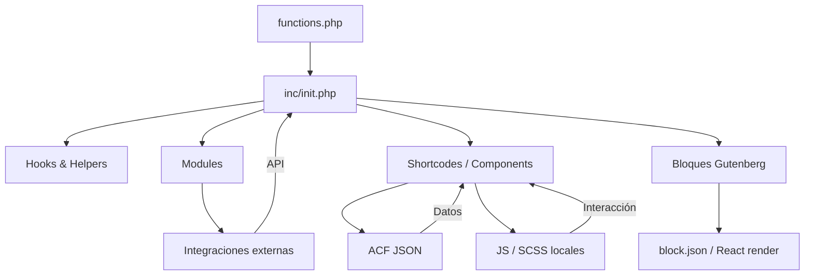

# 🧩 Arquitectura del Tema Modular EVAAS

**Versión:** 1.0.0
**Fecha:** October 2025

---

## 3. Diagrama de flujo

```mermaid
graph TD
  A[functions.php] --> B[inc/init.php]
  B --> C[Hooks & Helpers]
  B --> D[Modules]
  B --> E[Shortcodes / Components]
  B --> F[Bloques Gutenberg]
  E --> G[ACF JSON]
  E --> H[JS / SCSS locales]
  D --> I[Integraciones externas]
  F --> J[block.json / React render]
  G -->|Datos| E
  H -->|Interacción| E
  I -->|API| B
```
