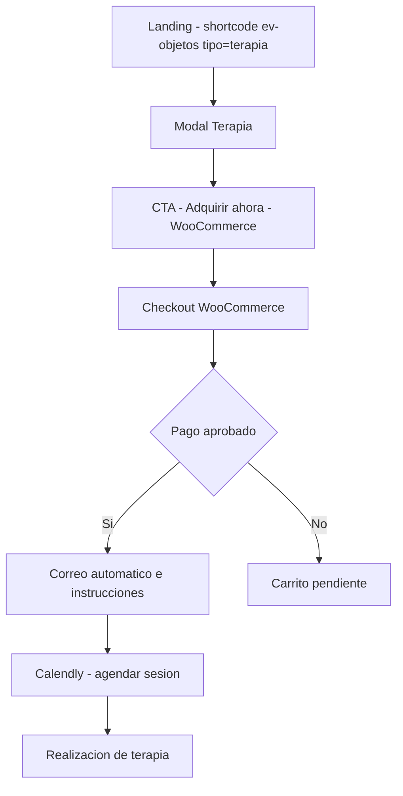
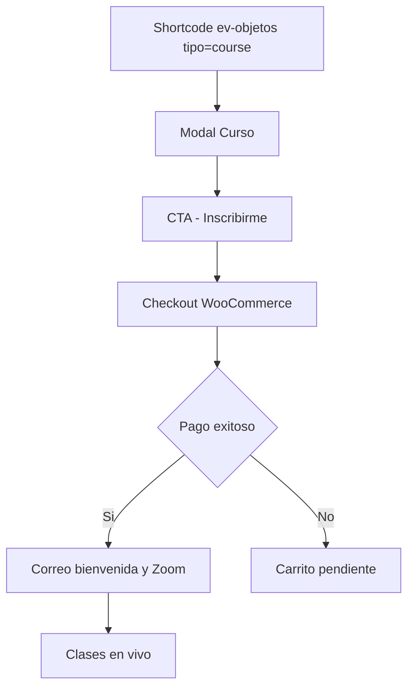
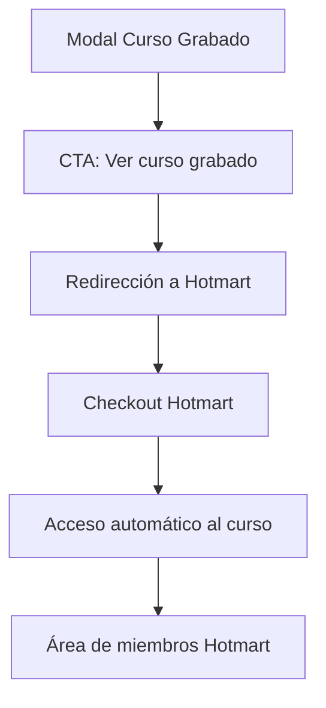
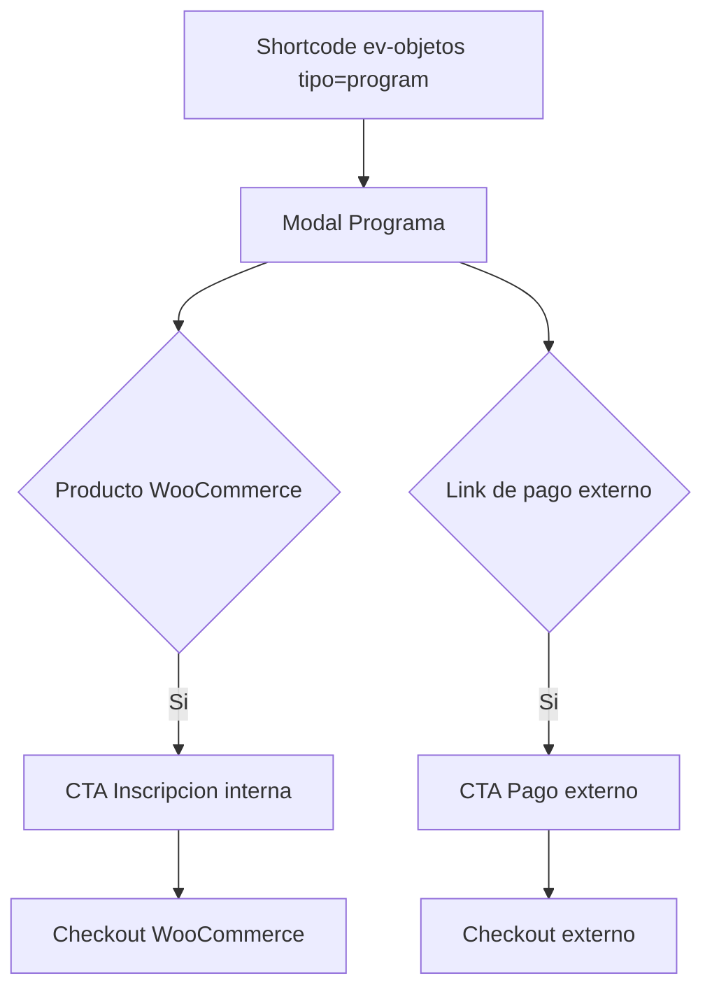
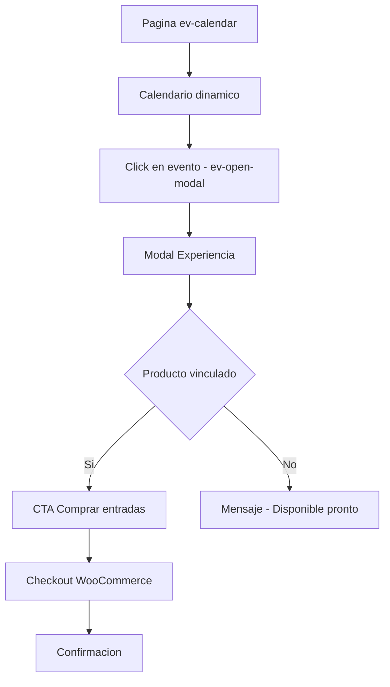
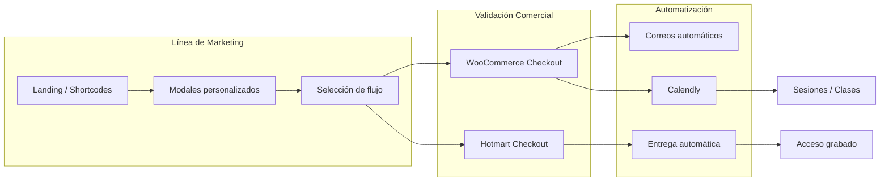

# 📜 INFORME DE FLUJOS DE VENTA – ESCUELA MÍSTICA
_Espacios Virtuales · Documentación Técnica & Energética_

---

## 🌕 FLUJO 1 — Terapias (WooCommerce + Calendly)

---

## 🌑 FLUJO 2 — Cursos Presenciales / En Vivo

---

## 🔥 FLUJO 3 — Cursos Grabados (Hotmart)

---

## 🌟 FLUJO 4 — Programas (Interno + Externo)

---

## 🧿 FLUJO 5 — Experiencias (Eventos Calendario)

---

## 🧬 FLUJO GENERAL DEL ECOSISTEMA

---

## 🛠️ COMPONENTES TÉCNICOS

- Shortcodes: `ev-objetos`, `ev-calendar`, `ev-about`, etc.
- ACF: `descripcion`, `propuesta_valor`, `objetivo`, `cliente_potencial`, `on`, `date`
- Metaboxes: `_linked_product_id`, `course_payment_url`, `course_modalidad`
- Módulos: `/modules/woocommerce/`, `/modules/emails/`, `/modules/calendario/`
- Estilos: sistema `.ev-modal` con variables de tema

---

## 🔮 RESUMEN

El flujo comercial se integra como un tejido entre:
- presentación → modal → decisión → transacción → experiencia  
con flujos mixtos WooCommerce / Hotmart / Calendly.

Nada está aislado. Cada paso sostiene al siguiente.

---

**Documento generado automáticamente.**
